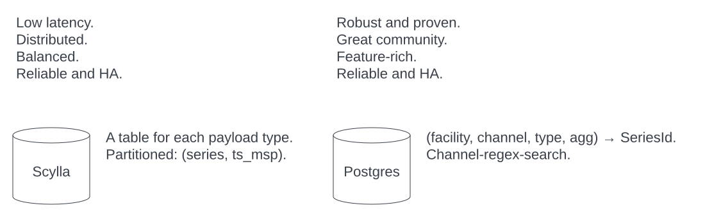

# Data stores




## Scylla schema

```cql
create keyspace ks1 with replication = { 'class': 'SimpleStrategy', 'replication_factor': 2 };
use ks1;
create table ts_msp (
    series bigint,
    ts_msp bigint,
    primary key (series, ts_msp)
) with default_time_to_live = 345600;

create table events_scalar_f32 (
    series bigint,
    ts_msp bigint,
    ts_lsp bigint,
    pulse bigint,
    value float,
    primary key ((series, ts_msp), ts_lsp)
) with default_time_to_live = 259200;

create table events_array_f32 (
    series bigint,
    ts_msp bigint,
    ts_lsp bigint,
    pulse bigint,
    value frozen<list<float>>,
    primary key ((series, ts_msp), ts_lsp)
) with default_time_to_live = 43200;
```
and instead of `f32` with similar tables for the other types: `u8..64`, `i8..i64`, `f64`, `bool`, `text`.

We have separate tables for the unsigned integers where we internally still have to use
the signed cql types of course.


## Rationale

* For reasonable performance, sizes of resulting partitions is very important.
* Partition size can not be enforced by Scylla on server side, but is writer's responsibility!
* Therefore, raw write access to Scylla should be limited to designated code.
* In this schema, partition size is determined by choice of `ts_msp` with `ts = ts_msp + ts_lsp`.
* Avoid thundering hordes: incorporate a series-specific offset in `ts_msp` (writer's responsibility).


## Postgres schema

```sql
create table series_by_channel (
    series bigint not null primary key,
    facility text not null,
    channel text not null,
    scalar_type int not null,
    shape_dims int[] not null,
    agg_kind int not null
);
create unique index series_by_channel_unique1 on series_by_channel (facility, channel);
create unique index series_by_channel_unique2 on series_by_channel (facility, channel, scalar_type, shape_dims, agg_kind);


create table ioc_by_channel (
    facility text,
    channel text,
    searchaddr text,
    addr text
);
create unique index on ioc_by_channel (facility, channel, searchaddr);
create index on ioc_by_channel (channel);
```
